# 保命事项
1. VCC等电压和GND接地千万不要接反! 否则板子升天, money打水漂.

## 元器件列表
感谢物院实验室某佬倾情相借!
1. Stm32 H750VBT6
2. 轮趣科技 Tb6612 稳压版电机驱动
3. 轮趣科技 MG513 霍尔解码器版电机
4. TJC3224K024 触控屏
5. PWlink2 lite版本 下载\调试器
6. 一块电池

## 使用工具
1. Vscode ＋ EIDE套装
2. Keil u5(
3. Stm Cube MX
4. USART HMI (TJC图形化编程工具) 

## 实践过程

### 接线

1. *电机* 和 *驱动板*接线, 这里直接使用附赠的排线连接.
2. *驱动板* 和 *Stm主板* 接线 ( 可以按照自己喜欢的布局连接, 也可以参考驱动板厂家给出的示例.
3. *显示屏* 和 *Stm主板* 接线 (TX,RX对接就完了), 这里电池给显示屏供电, 所以直接接到了驱动板引出的5v和GND.
4. *Pwlink2lite下载器* 和 *Stm主板* 接线( 这里要单独接一个TX->RX, 用来输出调试信息).
   
这里简单介绍下不同串口的接线意义:

#### 驱动板和Stm
1. 驱动板的 E2A和E2B (这里的2代表用的第二个电机,也就是B电机,"A","B"代表编码器的A相和B相) 接 Stm 的 两个Pin设定同一个TIM并且将该TIM设定为Combined Mode下的Encoder Mode用来解码从电机获取的实际转速(这里实际是 固定时间的位移 正比于速度, 可以当成转速来用)
2. 驱动板的 ADC 接口 (这里是用来读取电压) 接 Stm 的 Pin 设定为 ADC_IN.(呃呃,这里最后其实没把电压显示出来,所以没用上)
3. 驱动板的 PWMB (这里的B就是代表B电机了) 接 Stm 的 Pin 设定为 TIM 并将对应 TIM 的 对应 CH 设定为PWM GENERATION CHx, 用来输出PWM信号
4. 驱动版的 BIN1,2 接 Stm 的 Pin 设定为 GPIO OUTput, 用来设定电机旋转的模式

还有其他的使能,电源接口就不赘述了.可以查看 驱动板的使用说明
#### 触控屏和Stm
1. 触控屏使用UART通信, TX,RX 和 Stm 对接(小白注意嗷,TX->RX对接), Stm上的 两个Pin 设置RX,TX(这里用的USART), 并且要打开对应USART的NVIC (中断)

#### Stm和 PwLink2lite 下载器
1. 调试下载的直接对应相连, 电压接3v3, GND对接
2. Pwlink2lite 的 Rx 接到Stm 的 Pin 设置为 USART TX, 用来发送调试信息(后面的代码部分会提到Printf的重定向)


### Stm Cube MX 配置

这里的创建工程略过, 小白可以自己看看MX的教学视频

#### 串口设定(Pin OUT)

##### 这里的串口要对应好自己的实际接线. 

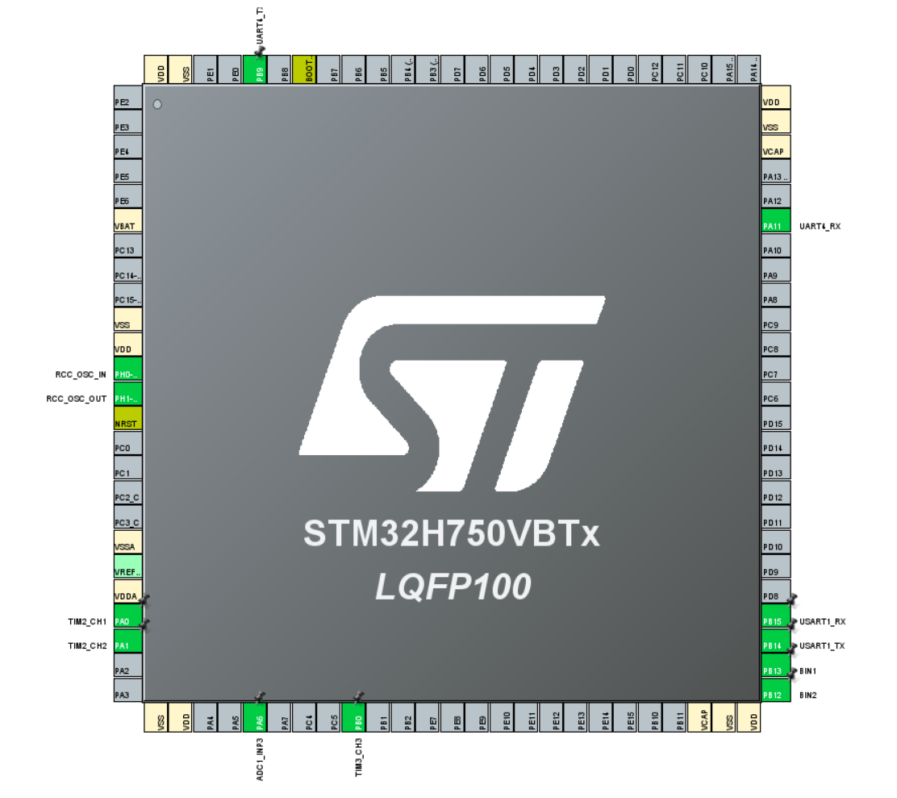

#### 串口相应功能设定

这些功能要对应好你实际的串口设定

##### TIM
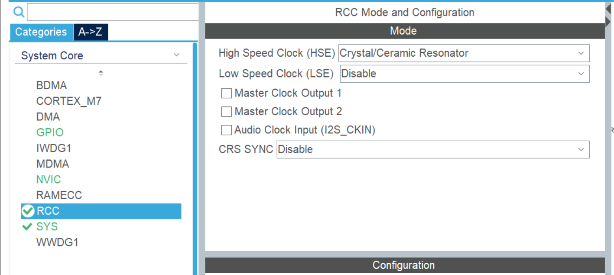
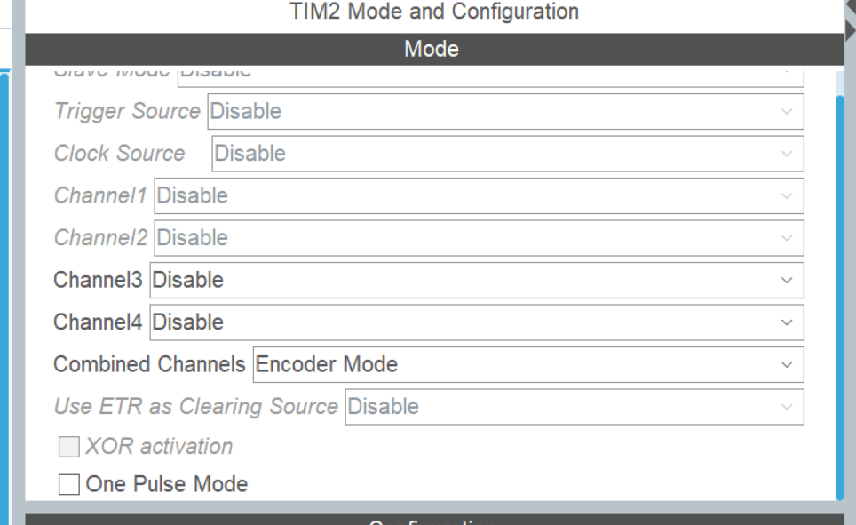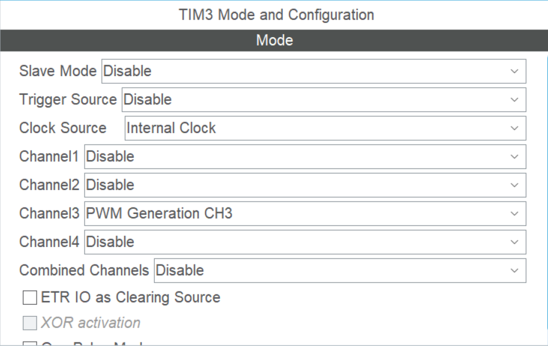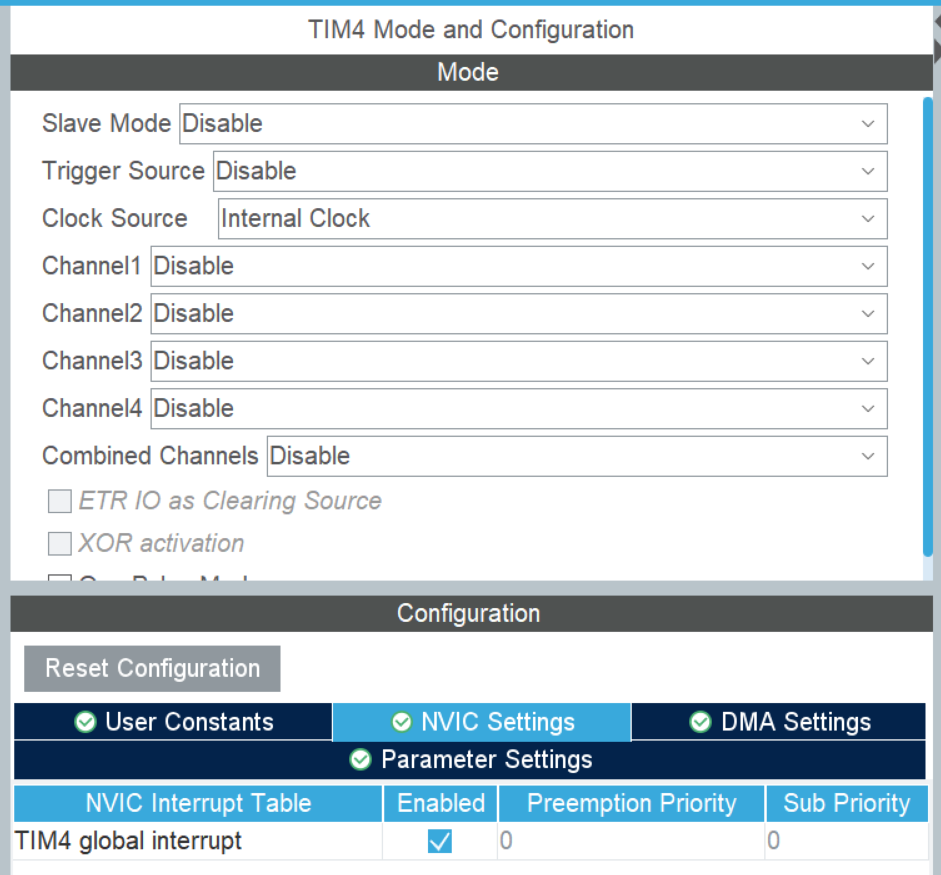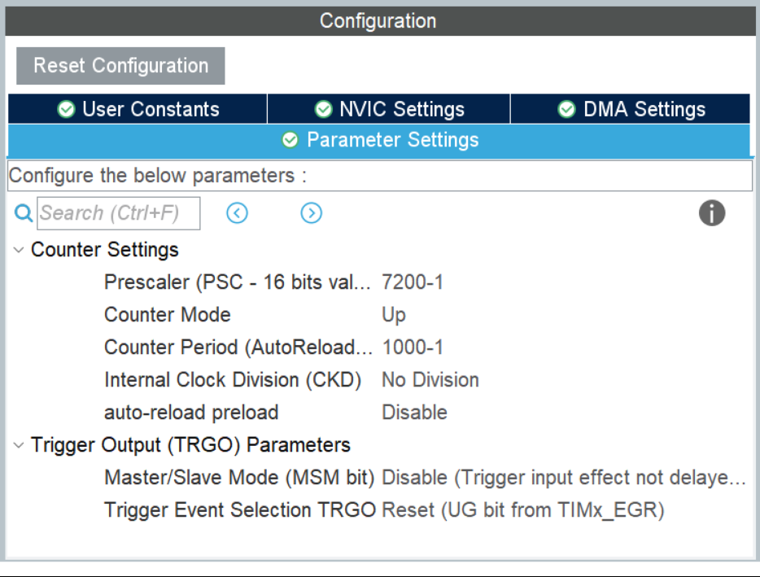

##### ADC
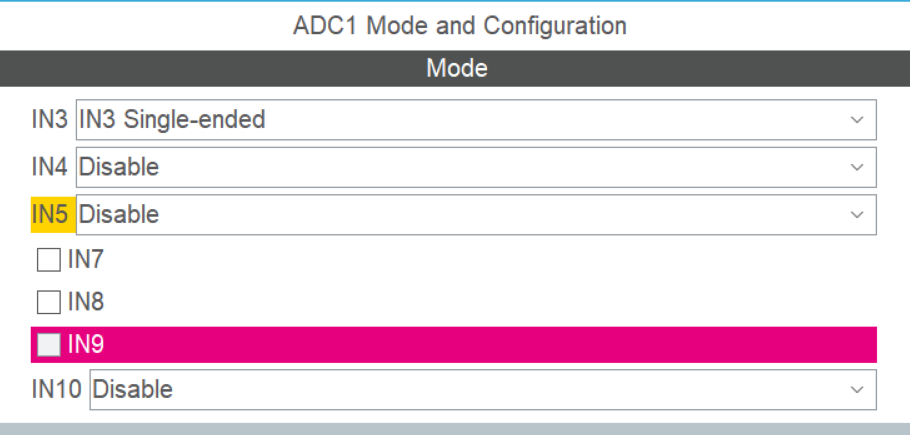

##### GPIO
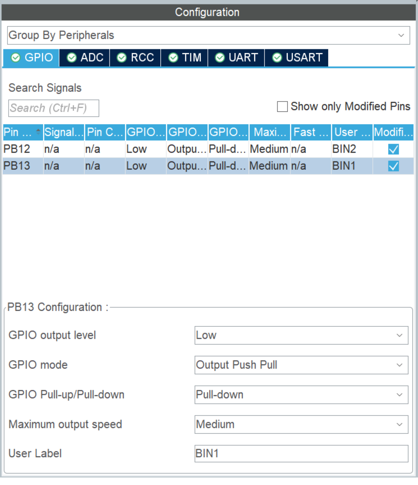

##### USART
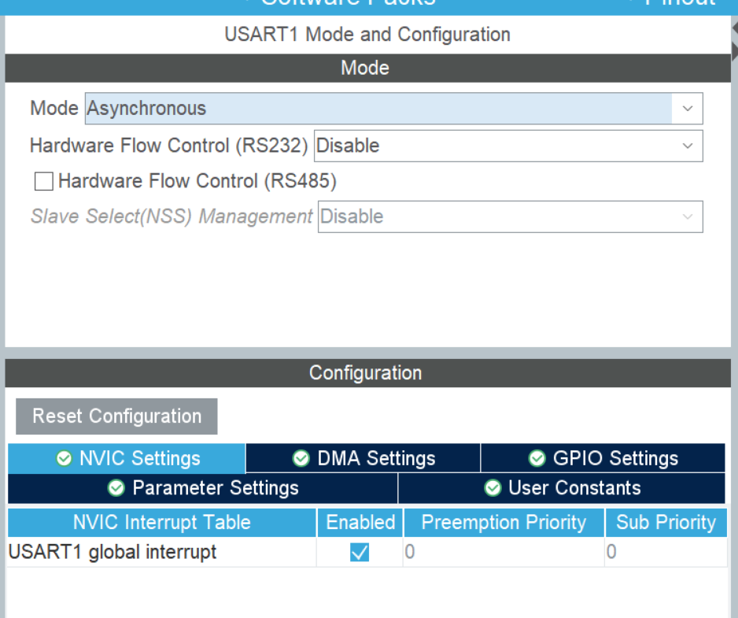
![发送调试信息到Pwlink2lite的Usart把Mode打开成Async就好]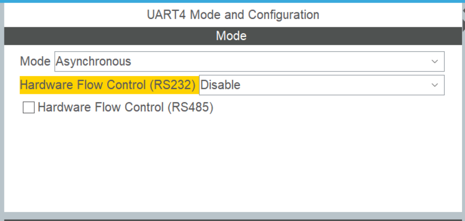

##### Project Manager
然后配置一下生成代码的设置, 让它生成单独的c/h文件, 并且生成MDK(Keil)的源代码, 这样后面的VSC + EIDE可以直接以MDK项目格式导入进去,嘎嘎方便.
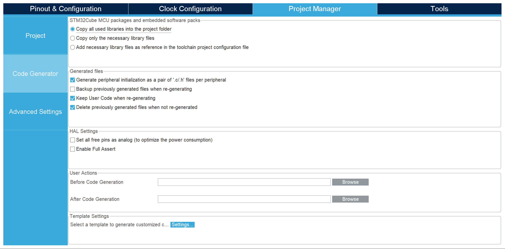
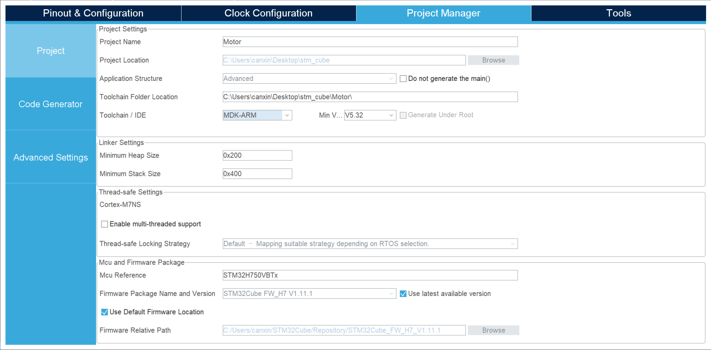

### USART HMI 写/刷 触控屏程序

小白可以先看看这个系列教程了解一下这个 陶晶驰的图形化设计软件的使用方法  

点击上面可以跳转到完整的系列视频⬆️⬆️⬆️

下面是正文⬇️⬇️⬇️

我设计的简陋的界面
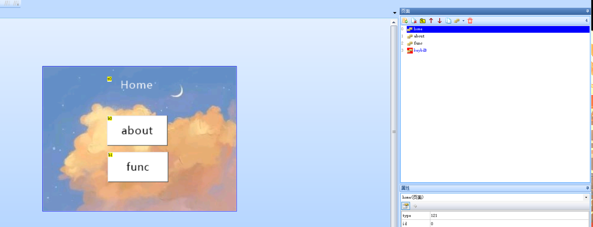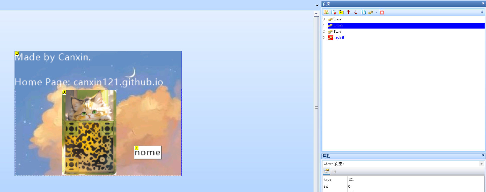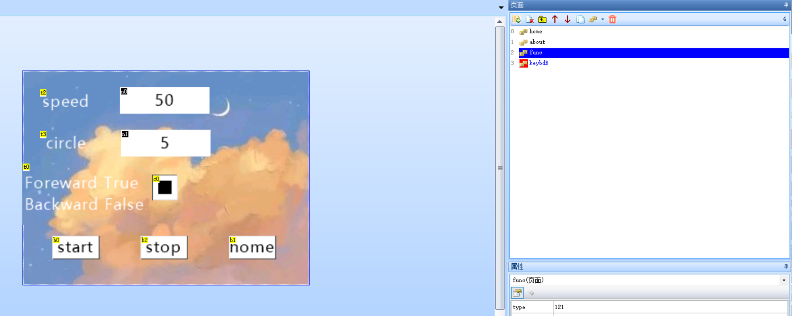

这里面唯一有用的就是func界面了(其他纯属引流嗷,建议别学我嗷
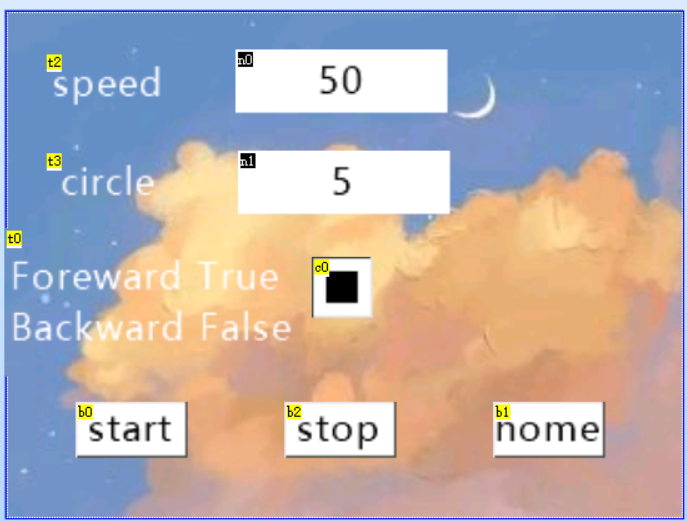

1. 首先需要两个数字框(绑定数字键盘), 一个用来设定目标速度,一个用来设定目标圈数,并且设定了初始值
2. 然后加个复选框来 选择 正转 or 反转
3. 然后加两个按钮, 一个start 一个 stop, 本质都是用uart发一些数据
   
这里两个按钮需要自己定义一个简单的通信协议, 我这里是这样极其简陋乱写的  
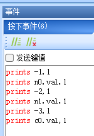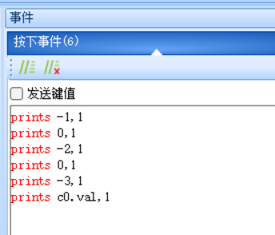  
也就是 [-1,速度的整数,-2,圈数的整数,-3,复选框(正/反转)的整数]  

搞定程序设计我们调试试一下效果,没有问题就可以把 屏幕用下载器接到电脑(自己简单对接可以)


### Vscode + EIDE  

#### 环境配置  
小白直接看这个教程吧


#### 控制代码
EIDE 导入项目后 开始写代码  
这里由于程序简单, 我直接全写在main.c了    

*这里注意一定要在 BEGIN 和 END 中间来写自己的代码, 否则CubeMX再次生成代码时, 会把你非用户代码区的代码删掉了.*  
*下面的代码中也只有 BEGIN 和 END 中间的代码是开发者自己写的,其他全部由CubeMX自动生成*
##### include
这里只用到了一个pid(这个代码分享在最后吧), 一个stdio(使用printf)

```c
/* USER CODE BEGIN Includes */
#include "pid.h"
#include "stdio.h"
/* USER CODE END Includes */
```
##### 用uart重定向printf到调试器

这个记住就好啦, 网上抄来的方法, 确实不错的方案
```c
int fputc(int ch, FILE *f)
{
  // 使用HAL库函数HAL_UART_Transmit将字符ch发送到UART4串口
  HAL_UART_Transmit(&huart4, (uint8_t *)&ch, 1, 0xFFFF);

  // 返回发送的字符，这通常不会有实际的影响，但是它需要返回发送的字符。
  return ch;
}

```

##### main函数

1. 初始化一些参数, 并初始化一个PID计算的结构体
2. 把屏幕控制的USART打开来接受信息, 并且设置每接受六次产生一次中断(因为上面的串口屏是设定的发送6个整数)

```c
/* USER CODE BEGIN 0 */

// 定义一个全局的PID结构体,用来计算PID的时候传参
struct PID_struct pid;
// 定义一个buf用来储存从屏幕的uart收到的消息(发了6个整数)
uint8_t rev_data[6];

/* USER CODE END 0 */

/**
 * @brief  The application entry point.
 * @retval int
 */
int main(void)
{
  /* USER CODE BEGIN 1 */

  /* USER CODE END 1 */

  /* MCU Configuration--------------------------------------------------------*/

  /* Reset of all peripherals, Initializes the Flash interface and the Systick. */
  HAL_Init();

  /* USER CODE BEGIN Init */

  /* USER CODE END Init */

  /* Configure the system clock */
  SystemClock_Config();

  /* USER CODE BEGIN SysInit */

  /* USER CODE END SysInit */

  /* Initialize all configured peripherals */
  MX_GPIO_Init();
  MX_TIM3_Init();
  MX_ADC1_Init();
  MX_TIM2_Init();
  MX_TIM4_Init();
  MX_UART4_Init();
  MX_USART1_UART_Init();
  /* USER CODE BEGIN 2 */

  // 这里是一个坑, 详情请看下面的PWM部分的Read_Encoder()
  TIM2->CNT = 0x7FFF;

  // 把屏幕的UART的接受消息打开, 
  HAL_UART_Receive_IT(&huart1, rev_data, 6);

  // 把PID结构体初始化,这里的P I D参数要看自己选择合适的值, 可以根据实际情况适当调节.
  float Incremental_KP = 3, Incremental_KI = 0.5, Incremental_KD = 1;

  // 调用PID初始化函数(这个代码我放在结尾吧, 作者是物院实验室某佬)
  // 这里最后两个参数是限定I项的, 具体左右可以看代码
  PID_init(&pid, Incremental_KP, Incremental_KI, Incremental_KD, 10, 10);
  /* USER CODE END 2 */

  /* Infinite loop */
  /* USER CODE BEGIN WHILE */

  while (1)
  {
    /* USER CODE END WHILE */

    /* USER CODE BEGIN 3 */
  }
  /* USER CODE END 3 */
}
```

##### 屏幕串口的UART中断

我们通过重定义中断回调函数来实现对HAL的中断回调的使用  
下面的代码 通过 屏幕串口USART中断来实现 不同状态下 激活/关闭 计时器和电机  

```c
// 这里定义一些变量
// 电机转一圈所需的Encoder读数累和
int Each_Circle = 1440;
// 设定的目标速度         Encoder读出的真实速度
int Target_Velocity = 0, Reality_Velocity = 0;
// 设定的目标位置总读数和 实际位置读数和
int Target_Position = 0, Reality_Position = 0;
// 给电机的PWM设定的占空比数值(这里需要每次累加,因为使用的是增程式pid)
int Set_Velocity = 0;

void Start_TIM(void)
{
  // Start Encoder tim 开启解码器时钟
  HAL_TIM_Encoder_Start(&htim2, TIM_CHANNEL_ALL);
  // Start Time Control tim 开启定时控制的时钟
  HAL_TIM_Base_Start_IT(&htim4);
  // Start the pwm tim 开启pwm输出的时钟
  HAL_TIM_PWM_Start(&htim3, TIM_CHANNEL_3);
}

void Stop_TIM(void)
{
  // 重置各种参数。 防止下次启动时有上次残留的值
  Target_Velocity = 0;
  Reality_Velocity = 0;
  Target_Position = 0;
  Reality_Position = 0;
  Set_Velocity = 0;
  // Stop Encoder tim 关闭解码器时钟
  HAL_TIM_Encoder_Stop(&htim2, TIM_CHANNEL_ALL);
  // Stop Time Control tim 关闭定时控制的时钟
  HAL_TIM_Base_Stop_IT(&htim4);
  // Stop the pwm tim 关闭pwm输出的时钟
  HAL_TIM_PWM_Stop(&htim3, TIM_CHANNEL_3);
}

// 这个函数用来设定电机 正转/反转/不转/刹车
void MoTo(int mode)
// 这里需要对照你的接线来设定,BIN1和BIN2对应的不同状态状态可以在驱动的说明中找到 
// 同时也要对应好 屏幕设定的 复选框 发送的0/1对应的正反转
/*
  1  foreward
  0  reversal
  -1 stop
  -2 brake
*/
{
  switch (mode)
  {
  case 1:
    HAL_GPIO_WritePin(GPIOB, BIN1_Pin, GPIO_PIN_RESET);
    HAL_GPIO_WritePin(GPIOB, BIN2_Pin, GPIO_PIN_SET);
    break;
  case 0:
    HAL_GPIO_WritePin(GPIOB, BIN1_Pin, GPIO_PIN_SET);
    HAL_GPIO_WritePin(GPIOB, BIN2_Pin, GPIO_PIN_RESET);
    break;
  case -1:
    HAL_GPIO_WritePin(GPIOB, BIN1_Pin, GPIO_PIN_RESET);
    HAL_GPIO_WritePin(GPIOB, BIN2_Pin, GPIO_PIN_RESET);
    break;
  case -2:
    HAL_GPIO_WritePin(GPIOB, BIN1_Pin, GPIO_PIN_SET);
    HAL_GPIO_WritePin(GPIOB, BIN2_Pin, GPIO_PIN_SET);
    break;
  default:
    HAL_GPIO_WritePin(GPIOB, BIN1_Pin, GPIO_PIN_RESET);
    HAL_GPIO_WritePin(GPIOB, BIN2_Pin, GPIO_PIN_RESET);
    break;
  }
}

void HAL_UART_RxCpltCallback(UART_HandleTypeDef *huart)
{
  // 这是HAL库提供的UART接收完成回调函数，当UART接收完成时，该函数会被自动调用。
  
  // 判断是哪个UART触发了回调，这里使用了单个UART1，可以根据实际情况进行扩展。
  if (huart == &huart1)
  {
    // 清除空闲中断标志位，UART通信中，空闲中断通常用于检测接收结束。
    __HAL_UART_CLEAR_IT(&huart1, UART_CLEAR_IDLEF);
    // 禁用UART发送中断，以防止在处理接收数据时发送数据。
    __HAL_UART_DISABLE_IT(huart, UART_IT_TXE);

    // 检查接收到的数据是否符合预期的协议，如果传输中出错了,就直接跳过不执行,根据协议格式解析数据。
    //                 -1                     -2                     -3
    if (rev_data[0] == 0xFF && rev_data[2] == 0xFE && rev_data[4] == 0xFD)
    {
      // 从接收到的数据中提取速度、圈数和模式信息。
      int speed = rev_data[1];
      int circle = rev_data[3];
      int mode = rev_data[5];

      // 检查速度和圈数是否都不为零，才需要转动。
      if (speed != 0 && circle != 0)
      {
        // 如果目标速度和位置都为零，则说明当前没有进行任何动作，可以开始新的动作。
        if (Target_Velocity == 0 && Target_Position == 0)
        {
          // 设置目标速度和目标位置。
          Target_Velocity = speed;
          Target_Position = circle * Each_Circle;
          
          // 根据模式调用MoTo函数执行相应的操作。
          // MoTo 函数定义时要把屏幕传过来的 (0/1) 和 真实转动的对应正确
          MoTo(mode);
          
          // 启动定时器,这样其他的中断才会发生。
          Start_TIM();
        }
      }
      else
      {
        // 如果速度或圈数为零，就说明要停下电机。
        MoTo(-2); // 调用MoTo函数执行刹停电机。
        
        // 重置各种参数(防止下次启动时有上次残留的值) 并且 停止定时器。 
        Stop_TIM();
      }
    }
    
    // 重新启用UART发送中断，以便后续可以发送数据。
    __HAL_UART_ENABLE_IT(huart, UART_IT_TXE);
    
    // 重新启用UART接收中断，以便继续接收数据。
    HAL_UART_Receive_IT(&huart1, rev_data, 6);
    
    // 清空UART的数据寄存器，以确保不会因为残留数据而触发接收中断。
    __HAL_UART_FLUSH_DRREGISTER(&huart1);
    
    // 清除UART接收缓冲区非空标志位，以确保下一次接收可以正常触发中断。
    __HAL_UART_CLEAR_FLAG(&huart1, UART_FLAG_RXNE);
  }
}
```

##### 固定时间间隔的 中断控制

之所以要新开一个 tim, 固定时间的读取encoder并设定pwm, 是为了
1. encoder读出的实际可以理解为转动的总距离, 只有时间间隔固定, 我们才能将固定时间的 转动距离差 当作 速度来用
2. 防止过快的设置pwm, 别把电机玩坏了(


```c
// 这里读取encoder有一个坑
// 由于这个encoder是一直累加(或减,取决于电机正反转)的, 它累加到最大值(减到0) 就自动重置了
// 因此你上一次读的数 不一定比 这次读的数大, 这样一算差值, 就可能出现一个极其大的负值
// 为了防止这种情况, 我们就需要把这个 tim 的读数一开始(main里面就设置了)
// 就设定到一个 中间数值(0和最大之间), 并且 每次读完之后都把它设定回去
// 这样就能保证每次都得到一个 计算正确的 值

int16_t Read_Encoder(void)
{
  int16_t count = __HAL_TIM_GET_COUNTER(&htim2);
  TIM2->CNT = 0x7FFF;

  count -= 0x7FFF;

  // 这里因为电机 正传反转 有一种情况是累加,一种是累减, 所以有正有负
  // 但是计算pid并设置pwm都是正值, 所以返回绝对值
  if (count < 0)
  {
    return count * -1;
  }
  else
  {
    return count;
  }
}


// 固定时间间隔的 中断控制, 每0.1秒多执行一次
void HAL_TIM_PeriodElapsedCallback(TIM_HandleTypeDef *htim)
{
  if (htim == &htim4)
  {
    // 读取实际转速(相当于转速)
    Reality_Velocity = Read_Encoder();
    // 转速累和相当于总距离(实际上转速使用这个总距离做差才算出来的,前面已经解释过了)
    Reality_Position += Reality_Velocity;
    // 每次先判断是不是已经到了设定的要转的总距离, 如果是, 刹车关定时器重置相关参数
    if (Reality_Position >= Target_Position)
    {
      // 刹车
      MoTo(-2);
      // 停止计时器
      Stop_TIM();
    }
    // 用PID算法计算出要设定的pwm值
    Set_Velocity += PID(&pid, Target_Velocity, Reality_Velocity);
    // 这里串口输出一下调试信息,方便查看
    printf("target: %d, real: %d, set: %d\n", Target_Velocity, Reality_Velocity, Set_Velocity);
    // 设定pwm值
    Set_Pwm(Set_Velocity);
  }
}

```

## 相关代码分享
### pid

由某物院实验室佬手写

pid.h
```c
#ifndef __PID_H_
#define __PID_H_

#define MAX_LEN 15

struct PID_struct
{
    float KP;
    float KI;
    float KD;
    float DATA[MAX_LEN];
    float MAX_I;
    int LEN;
    int is_first; // 解决D的首次误差减去0得到一个不正常的D值问题
    int top_index;
};

void PID_init(struct PID_struct *pid_struct, float kp, float ki, float kd, int len, int max_i);
float PID(struct PID_struct *pid_struct, float tar, float cur);

#endif
```

pid.c
```c
/**
 * @file PID
 * @author zl (2293721550@qq.com)
 * @brief 一个通用的PID函数，该PID接收返回数据全部为float类型
 *        使用时先构造PID_struct类型的结构体，再调用PID_init()函数初始化结构体，最后调用PID()函数得到PID的返回值
 * @version 0.1
 * @date 2023-08-24
 *
 * @copyright Copyright (c) 2023
 *
 */
#include "pid.h"

/**
 * @brief 初始化PID结构体
 *
 * @param pid_struct 想要初始化的PID结构体指针
 * @param kp P项比例系数
 * @param ki I项比例系数
 * @param kd D项比例系数
 * @param len I积分项长度(不能超过MAX_LEN的设定值)
 * @param max_i I项最大输出量,防止出现积分量过大导致的过冲
 */
void PID_init(struct PID_struct *pid_struct, float kp, float ki, float kd, int len, int max_i)
{
    pid_struct->KP = kp;
    pid_struct->KI = ki;
    pid_struct->KD = kd;
    pid_struct->LEN = len;
    pid_struct->MAX_I = max_i;

    pid_struct->is_first = 1;
    pid_struct->top_index = MAX_LEN - 1;
}

/**
 * @brief 求出积分项值
 *
 * @param pid_struct 想要处理的PID结构体指针
 * @return float
 */
float err_sum(struct PID_struct *pid_struct) // 获取I值
{
    float buf = 0;

    for (int i = 0; i < MAX_LEN; i++)
        buf += pid_struct->DATA[i];

    return buf;
}

/**
 * @brief 求出微分项值
 *
 * @param pid_struct 想要处理的PID结构体指针
 * @return float
 */
float err_change(struct PID_struct *pid_struct) // 获取D值
{
    float change_speed = 0;

    if (pid_struct->is_first != 1)
        if (pid_struct->top_index == 0)
            change_speed = pid_struct->DATA[pid_struct->top_index] - pid_struct->DATA[MAX_LEN - 1];
        else
            change_speed = pid_struct->DATA[pid_struct->top_index] - pid_struct->DATA[pid_struct->top_index - 1];
    else
        pid_struct->is_first = 0;

    return change_speed;
}

/**
 * @brief PID函数
 *
 * @param pid_struct 想要处理的PID结构体指针
 * @param tar 目标值
 * @param cur 当前值
 * @return float 返回PID计算后的值
 */
float PID(struct PID_struct *pid_struct, float tar, float cur)
{
    float pid = 0;
    float err = tar - cur;
    float P = 0;
    float I = 0;
    float D = 0;

    pid_struct->DATA[pid_struct->top_index] = err; // PID数据先进先出
    if (pid_struct->top_index - pid_struct->LEN >= 0)
        pid_struct->DATA[pid_struct->top_index - pid_struct->LEN] = 0;
    else
        pid_struct->DATA[pid_struct->top_index - pid_struct->LEN + MAX_LEN] = 0;

    P = pid_struct->DATA[pid_struct->top_index]; // 获取PID三值
    I = err_sum(pid_struct);
    D = err_change(pid_struct);

    pid_struct->top_index++; // 数据头向前移动一个
    if (pid_struct->top_index >= MAX_LEN)
        pid_struct->top_index = 0;

    if (I * pid_struct->KI > pid_struct->MAX_I)
        I = pid_struct->MAX_I / pid_struct->KI;
    else
        I = I; // 限制I的累计不可大于MAX_I

    pid = P * pid_struct->KP + I * pid_struct->KI + D * pid_struct->KD; // 计算出PID的返回值

    return pid;
}
```

### 完整的main.c程序
```c
/* USER CODE BEGIN Header */
/**
 ******************************************************************************
 * @file           : main.c
 * @brief          : Main program body
 ******************************************************************************
 * @attention
 *
 * Copyright (c) 2023 STMicroelectronics.
 * All rights reserved.
 *
 * This software is licensed under terms that can be found in the LICENSE file
 * in the root directory of this software component.
 * If no LICENSE file comes with this software, it is provided AS-IS.
 *
 ******************************************************************************
 */
/* USER CODE END Header */
/* Includes ------------------------------------------------------------------*/
#include "main.h"
#include "adc.h"
#include "tim.h"
#include "usart.h"
#include "gpio.h"

/* Private includes ----------------------------------------------------------*/
/* USER CODE BEGIN Includes */
#include "pid.h"
#include "stdio.h"
/* USER CODE END Includes */

/* Private typedef -----------------------------------------------------------*/
/* USER CODE BEGIN PTD */

/* USER CODE END PTD */

/* Private define ------------------------------------------------------------*/
/* USER CODE BEGIN PD */

/* USER CODE END PD */

/* Private macro -------------------------------------------------------------*/
/* USER CODE BEGIN PM */

/* USER CODE END PM */

/* Private variables ---------------------------------------------------------*/

/* USER CODE BEGIN PV */

/* USER CODE END PV */

/* Private function prototypes -----------------------------------------------*/
void SystemClock_Config(void);
/* USER CODE BEGIN PFP */

/* USER CODE END PFP */

/* Private user code ---------------------------------------------------------*/
/* USER CODE BEGIN 0 */
// redirect `printf`

int fputc(int ch, FILE *f)
{
  // 使用HAL库函数HAL_UART_Transmit将字符ch发送到UART4串口
  HAL_UART_Transmit(&huart4, (uint8_t *)&ch, 1, 0xFFFF);

  // 返回发送的字符，这通常不会有实际的影响，但是它需要返回发送的字符。
  return ch;
}

// uint16_t Get_adc(void)
// {

//   HAL_ADC_Start(&hadc1);

//   HAL_ADC_PollForConversion(&hadc1, 2);

//   if (HAL_IS_BIT_SET(HAL_ADC_GetState(&hadc1), HAL_ADC_STATE_REG_EOC))
//   {

//     return HAL_ADC_GetValue(&hadc1);
//   }
//   else
//   {
//     return Get_adc();
//   }
// }

// uint16_t Get_adc_Average(uint8_t times)
// {
//   uint32_t sum = 0;
//   for (uint8_t i = 0; i < times; i++)
//   {
//     sum += Get_adc();
//   }
//   return sum / times;
// }

// define pid struct
struct PID_struct pid;
// the buf for screen usart
uint8_t rev_data[6];

/* USER CODE END 0 */

/**
 * @brief  The application entry point.
 * @retval int
 */
int main(void)
{
  /* USER CODE BEGIN 1 */

  /* USER CODE END 1 */

  /* MCU Configuration--------------------------------------------------------*/

  /* Reset of all peripherals, Initializes the Flash interface and the Systick. */
  HAL_Init();

  /* USER CODE BEGIN Init */

  /* USER CODE END Init */

  /* Configure the system clock */
  SystemClock_Config();

  /* USER CODE BEGIN SysInit */

  /* USER CODE END SysInit */

  /* Initialize all configured peripherals */
  MX_GPIO_Init();
  MX_TIM3_Init();
  MX_ADC1_Init();
  MX_TIM2_Init();
  MX_TIM4_Init();
  MX_UART4_Init();
  MX_USART1_UART_Init();
  // 这里是一个坑, 详情请看下面的PWM部分的Read_Encoder()
  TIM2->CNT = 0x7FFF;

  // 把屏幕的UART的接受消息打开,
  HAL_UART_Receive_IT(&huart1, rev_data, 6);

  // 把PID结构体初始化,这里的P I D参数要看自己选择合适的值, 可以根据实际情况适当调节.
  float Incremental_KP = 3, Incremental_KI = 0.5, Incremental_KD = 1;

  // 调用PID初始化函数(这个代码我放在结尾吧, 作者是物院实验室某佬)
  // 这里最后两个参数是限定I项的, 具体左右可以看代码
  PID_init(&pid, Incremental_KP, Incremental_KI, Incremental_KD, 10, 10);
  /* USER CODE END 2 */

  /* Infinite loop */
  /* USER CODE BEGIN WHILE */

  while (1)
  {
    /* USER CODE END WHILE */

    /* USER CODE BEGIN 3 */
  }
  /* USER CODE END 3 */
}

/**
 * @brief System Clock Configuration
 * @retval None
 */
void SystemClock_Config(void)
{
  RCC_OscInitTypeDef RCC_OscInitStruct = {0};
  RCC_ClkInitTypeDef RCC_ClkInitStruct = {0};

  /** Supply configuration update enable
   */
  HAL_PWREx_ConfigSupply(PWR_LDO_SUPPLY);

  /** Configure the main internal regulator output voltage
   */
  __HAL_PWR_VOLTAGESCALING_CONFIG(PWR_REGULATOR_VOLTAGE_SCALE3);

  while (!__HAL_PWR_GET_FLAG(PWR_FLAG_VOSRDY))
  {
  }

  /** Initializes the RCC Oscillators according to the specified parameters
   * in the RCC_OscInitTypeDef structure.
   */
  RCC_OscInitStruct.OscillatorType = RCC_OSCILLATORTYPE_HSI;
  RCC_OscInitStruct.HSIState = RCC_HSI_DIV1;
  RCC_OscInitStruct.HSICalibrationValue = RCC_HSICALIBRATION_DEFAULT;
  RCC_OscInitStruct.PLL.PLLState = RCC_PLL_ON;
  RCC_OscInitStruct.PLL.PLLSource = RCC_PLLSOURCE_HSI;
  RCC_OscInitStruct.PLL.PLLM = 4;
  RCC_OscInitStruct.PLL.PLLN = 9;
  RCC_OscInitStruct.PLL.PLLP = 2;
  RCC_OscInitStruct.PLL.PLLQ = 2;
  RCC_OscInitStruct.PLL.PLLR = 2;
  RCC_OscInitStruct.PLL.PLLRGE = RCC_PLL1VCIRANGE_3;
  RCC_OscInitStruct.PLL.PLLVCOSEL = RCC_PLL1VCOMEDIUM;
  RCC_OscInitStruct.PLL.PLLFRACN = 3072;
  if (HAL_RCC_OscConfig(&RCC_OscInitStruct) != HAL_OK)
  {
    Error_Handler();
  }

  /** Initializes the CPU, AHB and APB buses clocks
   */
  RCC_ClkInitStruct.ClockType = RCC_CLOCKTYPE_HCLK | RCC_CLOCKTYPE_SYSCLK | RCC_CLOCKTYPE_PCLK1 | RCC_CLOCKTYPE_PCLK2 | RCC_CLOCKTYPE_D3PCLK1 | RCC_CLOCKTYPE_D1PCLK1;
  RCC_ClkInitStruct.SYSCLKSource = RCC_SYSCLKSOURCE_PLLCLK;
  RCC_ClkInitStruct.SYSCLKDivider = RCC_SYSCLK_DIV1;
  RCC_ClkInitStruct.AHBCLKDivider = RCC_HCLK_DIV1;
  RCC_ClkInitStruct.APB3CLKDivider = RCC_APB3_DIV1;
  RCC_ClkInitStruct.APB1CLKDivider = RCC_APB1_DIV2;
  RCC_ClkInitStruct.APB2CLKDivider = RCC_APB2_DIV2;
  RCC_ClkInitStruct.APB4CLKDivider = RCC_APB4_DIV1;

  if (HAL_RCC_ClockConfig(&RCC_ClkInitStruct, FLASH_LATENCY_1) != HAL_OK)
  {
    Error_Handler();
  }
}

/* USER CODE BEGIN 4 */

// 这里定义一些变量
// 电机转一圈所需的Encoder读数累和
int Each_Circle = 1440;
// 设定的目标速度         Encoder读出的真实速度
int Target_Velocity = 0, Reality_Velocity = 0;
// 设定的目标位置总读数和 实际位置读数和
int Target_Position = 0, Reality_Position = 0;
// 给电机的PWM设定的占空比数值(这里需要每次累加,因为使用的是增程式pid)
int Set_Velocity = 0;

void Start_TIM(void)
{
  // Start Encoder tim 开启解码器时钟
  HAL_TIM_Encoder_Start(&htim2, TIM_CHANNEL_ALL);
  // Start Time Control tim 开启定时控制的时钟
  HAL_TIM_Base_Start_IT(&htim4);
  // Start the pwm tim 开启pwm输出的时钟
  HAL_TIM_PWM_Start(&htim3, TIM_CHANNEL_3);
}

void Stop_TIM(void)
{
  // 重置各种参数。 防止下次启动时有上次残留的值
  Target_Velocity = 0;
  Reality_Velocity = 0;
  Target_Position = 0;
  Reality_Position = 0;
  Set_Velocity = 0;
  // Stop Encoder tim 关闭解码器时钟
  HAL_TIM_Encoder_Stop(&htim2, TIM_CHANNEL_ALL);
  // Stop Time Control tim 关闭定时控制的时钟
  HAL_TIM_Base_Stop_IT(&htim4);
  // Stop the pwm tim 关闭pwm输出的时钟
  HAL_TIM_PWM_Stop(&htim3, TIM_CHANNEL_3);
}

// 这个函数用来设定电机 正转/反转/不转/刹车
void MoTo(int mode)
// 这里需要对照你的接线来设定,BIN1和BIN2对应的不同状态状态可以在驱动的说明中找到
// 同时也要对应好 屏幕设定的 复选框 发送的0/1对应的正反转
/*
  1  foreward
  0  reversal
  -1 stop
  -2 brake
*/
{
  switch (mode)
  {
  case 1:
    HAL_GPIO_WritePin(GPIOB, BIN1_Pin, GPIO_PIN_RESET);
    HAL_GPIO_WritePin(GPIOB, BIN2_Pin, GPIO_PIN_SET);
    break;
  case 0:
    HAL_GPIO_WritePin(GPIOB, BIN1_Pin, GPIO_PIN_SET);
    HAL_GPIO_WritePin(GPIOB, BIN2_Pin, GPIO_PIN_RESET);
    break;
  case -1:
    HAL_GPIO_WritePin(GPIOB, BIN1_Pin, GPIO_PIN_RESET);
    HAL_GPIO_WritePin(GPIOB, BIN2_Pin, GPIO_PIN_RESET);
    break;
  case -2:
    HAL_GPIO_WritePin(GPIOB, BIN1_Pin, GPIO_PIN_SET);
    HAL_GPIO_WritePin(GPIOB, BIN2_Pin, GPIO_PIN_SET);
    break;
  default:
    HAL_GPIO_WritePin(GPIOB, BIN1_Pin, GPIO_PIN_RESET);
    HAL_GPIO_WritePin(GPIOB, BIN2_Pin, GPIO_PIN_RESET);
    break;
  }
}

void HAL_UART_RxCpltCallback(UART_HandleTypeDef *huart)
{
  // 这是HAL库提供的UART接收完成回调函数，当UART接收完成时，该函数会被自动调用。

  // 判断是哪个UART触发了回调，这里使用了单个UART1，可以根据实际情况进行扩展。
  if (huart == &huart1)
  {
    // 清除空闲中断标志位，UART通信中，空闲中断通常用于检测接收结束。
    __HAL_UART_CLEAR_IT(&huart1, UART_CLEAR_IDLEF);
    // 禁用UART发送中断，以防止在处理接收数据时发送数据。
    __HAL_UART_DISABLE_IT(huart, UART_IT_TXE);

    // 检查接收到的数据是否符合预期的协议，如果传输中出错了,就直接跳过不执行,根据协议格式解析数据。
    //                 -1                     -2                     -3
    if (rev_data[0] == 0xFF && rev_data[2] == 0xFE && rev_data[4] == 0xFD)
    {
      // 从接收到的数据中提取速度、圈数和模式信息。
      int speed = rev_data[1];
      int circle = rev_data[3];
      int mode = rev_data[5];

      // 检查速度和圈数是否都不为零，才需要转动。
      if (speed != 0 && circle != 0)
      {
        // 如果目标速度和位置都为零，则说明当前没有进行任何动作，可以开始新的动作。
        if (Target_Velocity == 0 && Target_Position == 0)
        {
          // 设置目标速度和目标位置。
          Target_Velocity = speed;
          Target_Position = circle * Each_Circle;

          // 根据模式调用MoTo函数执行相应的操作。
          // MoTo 函数定义时要把屏幕传过来的 (0/1) 和 真实转动的对应正确
          MoTo(mode);

          // 启动定时器,这样其他的中断才会发生。
          Start_TIM();
        }
      }
      else
      {
        // 如果速度或圈数为零，就说明要停下电机。
        MoTo(-2); // 调用MoTo函数执行刹停电机。

        // 重置各种参数(防止下次启动时有上次残留的值) 并且 停止定时器。
        Stop_TIM();
      }
    }

    // 重新启用UART发送中断，以便后续可以发送数据。
    __HAL_UART_ENABLE_IT(huart, UART_IT_TXE);

    // 重新启用UART接收中断，以便继续接收数据。
    HAL_UART_Receive_IT(&huart1, rev_data, 6);

    // 清空UART的数据寄存器，以确保不会因为残留数据而触发接收中断。
    __HAL_UART_FLUSH_DRREGISTER(&huart1);

    // 清除UART接收缓冲区非空标志位，以确保下一次接收可以正常触发中断。
    __HAL_UART_CLEAR_FLAG(&huart1, UART_FLAG_RXNE);
  }
}

// 这里读取encoder有一个坑
// 由于这个encoder是一直累加(或减,取决于电机正反转)的, 它累加到最大值(减到0) 就自动重置了
// 因此你上一次读的数 不一定比 这次读的数大, 这样一算差值, 就可能出现一个极其大的负值
// 为了防止这种情况, 我们就需要把这个 tim 的读数一开始(main里面就设置了)
// 就设定到一个 中间数值(0和最大之间), 并且 每次读完之后都把它设定回去
// 这样就能保证每次都得到一个 计算正确的 值

int16_t Read_Encoder(void)
{
  int16_t count = __HAL_TIM_GET_COUNTER(&htim2);
  TIM2->CNT = 0x7FFF;

  count -= 0x7FFF;

  // 这里因为电机 正传反转 有一种情况是累加,一种是累减, 所以有正有负
  // 但是计算pid并设置pwm都是正值, 所以返回绝对值
  if (count < 0)
  {
    return count * -1;
  }
  else
  {
    return count;
  }
}

int Dead_Voltage = 160;

void Set_Pwm(int Velocity)
{
  __HAL_TIM_SET_COMPARE(&htim3, TIM_CHANNEL_3, Velocity + Dead_Voltage);
}

// 固定时间间隔的 中断控制, 每0.1秒多执行一次
void HAL_TIM_PeriodElapsedCallback(TIM_HandleTypeDef *htim)
{
  if (htim == &htim4)
  {
    // 读取实际转速(相当于转速)
    Reality_Velocity = Read_Encoder();
    // 转速累和相当于总距离(实际上转速使用这个总距离做差才算出来的,前面已经解释过了)
    Reality_Position += Reality_Velocity;
    // 每次先判断是不是已经到了设定的要转的总距离, 如果是, 刹车关定时器重置相关参数
    if (Reality_Position >= Target_Position)
    {
      // 刹车
      MoTo(-2);
      // 停止计时器
      Stop_TIM();
    }
    // 用PID算法计算出要设定的pwm值
    Set_Velocity += PID(&pid, Target_Velocity, Reality_Velocity);
    // 这里串口输出一下调试信息,方便查看
    printf("target: %d, real: %d, set: %d\n", Target_Velocity, Reality_Velocity, Set_Velocity);
    // 设定pwm值
    Set_Pwm(Set_Velocity);
  }
}

/* USER CODE END 4 */

/**
 * @brief  This function is executed in case of error occurrence.
 * @retval None
 */
void Error_Handler(void)
{
  /* USER CODE BEGIN Error_Handler_Debug */
  /* User can add his own implementation to report the HAL error return state */
  __disable_irq();
  while (1)
  {
  }
  /* USER CODE END Error_Handler_Debug */
}

#ifdef USE_FULL_ASSERT
/**
 * @brief  Reports the name of the source file and the source line number
 *         where the assert_param error has occurred.
 * @param  file: pointer to the source file name
 * @param  line: assert_param error line source number
 * @retval None
 */
void assert_failed(uint8_t *file, uint32_t line)
{
  /* USER CODE BEGIN 6 */
  /* User can add his own implementation to report the file name and line number,
     ex: printf("Wrong parameters value: file %s on line %d\r\n", file, line) */
  /* USER CODE END 6 */
}
#endif /* USE_FULL_ASSERT */
```