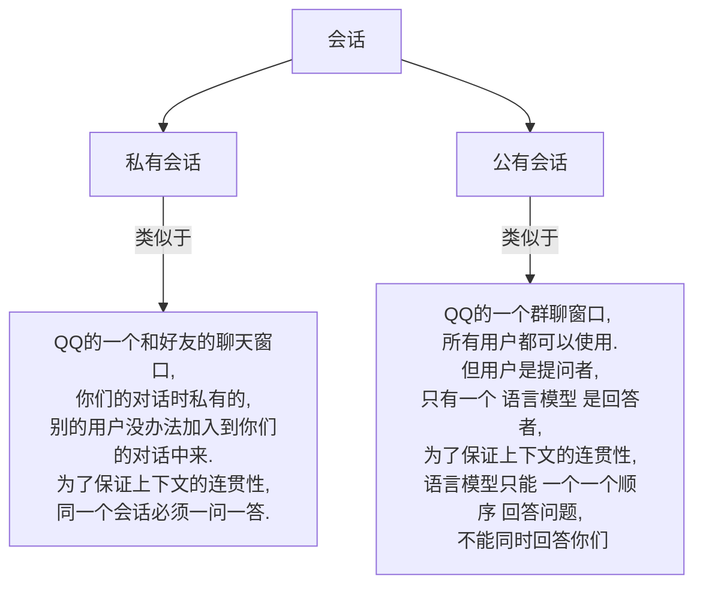
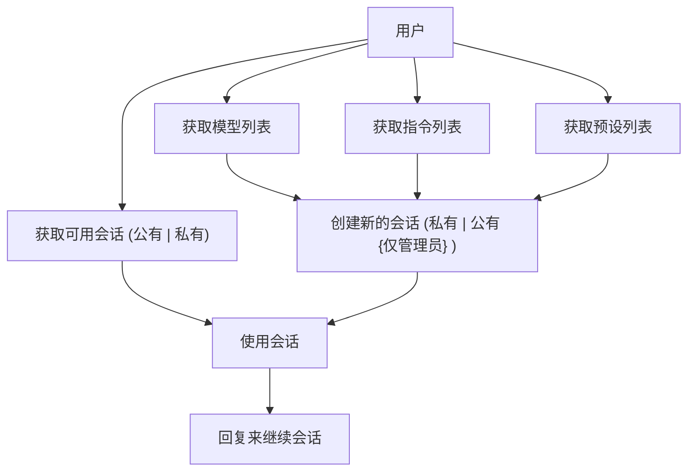

Feature:  
- 使用Nonebot框架跨适配器实现,多聊天平台同步实现
- 支持 QQ, QQ频道, Kook, 飞书, Telegram, Discord
- 支持跨平台账户绑定,多平台账户统一数据
- 适配多来源语言模型, 多态模型
- 实现 多用户, 多会话窗口, 公共会话和私有会话
- 实现 流式输出 , 文转图, 文转网络剪切板链接 
- 实现WebUi编辑配置,实时热更新
  
ToDo:  
- 负载均衡
- 用户权限系统

模型来源支持情况:  
✔️:支持 ❌:不支持  

| 来源         | 传入文本 | 传入图片 | 输出文本 | 输出图片 |
| ------------ | -------- | -------- | -------- | -------- |
| Newbing      | ✔️        | ✔️        | ✔️        | ✔️        |
| Poe          | ✔️        | ❌        | ✔️        | ❌        |
| ChatGPT Api  | ✔️        | ❌        | ✔️        | ❌        |
| ChatGPT 网页 | ✔️        | ❌        | ✔️        | ❌        |
| Claude.Ai    | ✔️        | ❌        | ✔️        | ❌        |
| Slack Claude | ✔️        | ❌        | ✔️        | ❌        |
  
Ps: `各来源的配置使用均在WebUi中已有详细说明`

聊天平台支持情况:
✔️:支持 ❌:不支持  

| 来源     | 传入文本 | 传入图片 | 输出文本 | 输出图片 |
| -------- | -------- | -------- | -------- | -------- |
| QQ       | ✔️        | ✔️        | ✔️        | ✔️        |
| QQ频道   | ✔️        | ✔️        | ✔️        | ✔️        |
| Kook     | ✔️        | ❌        | ✔️        | ✔️        |
| 飞书     | ✔️        | ❌        | ✔️        | ✔️        |
| Telegram | ✔️        | ✔️        | ✔️        | ✔️        |
| Discord  | ✔️        | ✔️        | ✔️        | ✔️        |
  
Ps: `各聊天平台接入,请查看对应的Nonebot适配器使用说明`





在本插件中,`会话`指的是 一个独立的由指定`模型`驱动的聊天上下文  

会话的分类如下:  




<!-- 模型开始 -->


在本插件中,`模型`指的是驱动`会话`的实际的回复人
`模型`需要在web ui中配置相关内容才可以启用



在本插件中,`预设`指每次新对话开始前,优先加载的**人格**  
原理:  
    基本是在`会话`开始前,自动先向会话中发送预设文本,也有特殊的来源会使用其他方法   

注意:
- `预设` 不一定对所有的`模型`都有效,因为有些模型本身会 阻止这种对模型输出行为的干预
- `预设` 的字数不是越长越好, 字数也会有**上限**,各模型的上限不一, 超出上限会报错, 只能自行更改预设


<!-- 模型结束 -->
<!-- 指令开始 -->

在本插件中,`指令`指自动填充在问题前面的指令,可以用来命令`模型`一定的格式或者要求进行回复

原理:
    在发送用户的问题之前,现在用户的问题前面加上`指令`文本,然后再发送过去
注意:
- `指令`字数有**上限**,各模型的上限不一, 超出上限会报错, 只能自行更改指令

<!-- 指令结束 -->




<!-- 基本使用逻辑开始 -->





<!-- 基本使用逻辑结束 -->





**这里直接看Well404的教程吧,点击即可跳转到b站系列教程**





在这里我直接贴出个适配器的官方使用文档或者合适的教程了


首先是qsign的部署,这个目前是 必须的

然后需要使用 gocq 的dev 版本,这里给出 gocq dev的action地址,可以自行在这里寻找合适的构建版本,  
而连接到nb的方法在上面的 nonebot部署教程中已经又过了,这里不在放出地址  
[gocq-dev Action CL](https://github.com/Mrs4s/go-cqhttp/actions/workflows/ci.yml)



[QQ频道适配器 gh链接](https://github.com/nonebot/adapter-qqguild)



[KOOK(开黑啦)适配器 gh链接](https://github.com/Tian-que/nonebot-adapter-kaiheila)



[飞书(Lark)适配器 gh链接](https://feishu.adapters.nonebot.dev/docs/guide/installation)



[Telegram适配器 gh链接](https://github.com/nonebot/adapter-telegram)



[Discord适配器 gh链接](https://github.com/nonebot/adapter-discord)








```bash
nb plugin install spark_gpt
```





1. SparkGPT 依赖 [nonebot_plugin_web_config](https://github.com/canxin121/nonebot_plugin_web_config) 进行实时配置热更新,所以需要配置的相关信息,可以点击进入查看相关的env配置.
2. SparkGPT 的GPT来源需要手动配置相应的 auth 信息才可以使用,具体获取方式都均在web ui(默认[http://127.0.0.1:8666](http://127.0.0.1:8666))中医用标出,并可以实时热更新.








